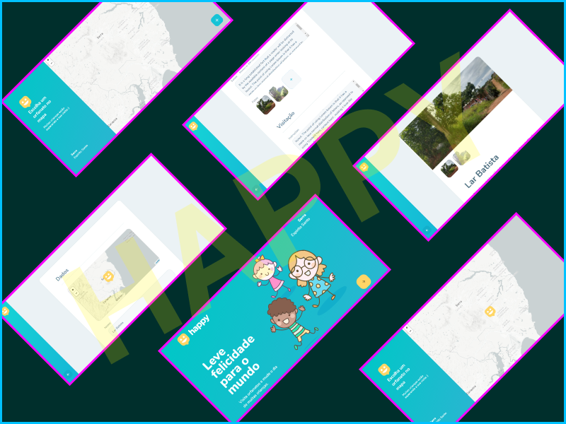
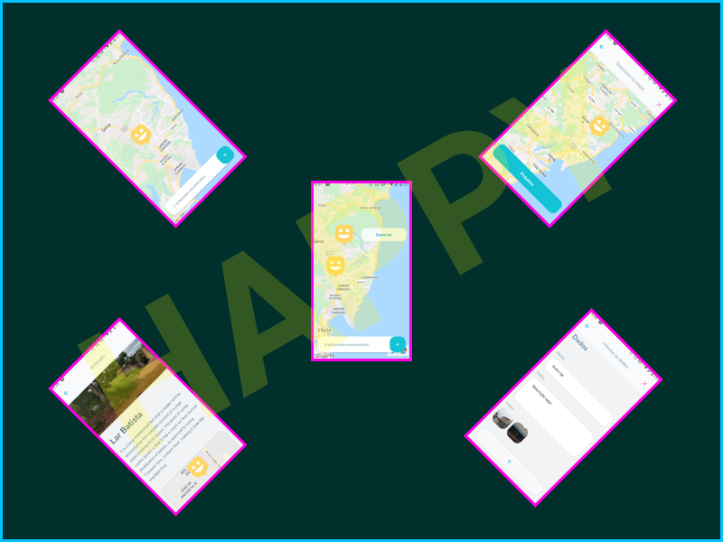

# Happy

Next Level Week Application from Rocketseat


Semana intensiva e gratuita de programação, fornecido pela [Rocketseat](https://rocketseat.com.br/), trabalhando com a stack mais atual do ecossistema web, stack inclui React, Node e React Native.




## Configuração

Para funcionar corretamente, algumas coisas precisam ser configuradas:

Altere os arquivos `.env` das pastas `BACKEND` e `WEB`.

    BASE_URL: URL do backend para a view (default: localhost:8080)
    REACT_APP_API_URL: URL do backend para API
    REACT_APP_MAPBOX_TOKEN: Token do mapa MAPBOX.

MAPBOX_TOKEN pode ser alterado para qualquer nome. E o mapa pode ser alterado no TitleLayer em `web/src/pages/OrphanagesMap/index.tsx`

Forneça uma chave MAPBOX para poder usar o mapa sem problemas.

Para o `MOBILE` funcionar corretamente, altere `baseURL` em `mobile/src/services/api` para o link do seu backend. Não use `localhost` nesse caso, use o IP da sua maquina, caso local, ou use a URL do seu backend caso ele já esteja hospedado. Em emuladores é possível usar `localhost` em alguns emuladores.

## Instalação

Após clonar, rode os comandos abaixo:

**BACKEND - TERMINAL 1**:

```cmd
    cd backend
    yarn install
```

**WEB APP - TERMINAL 2**:

```cmd
    cd web
    yarn install
```

**MOBILE APP - TERMINAL 3**:

```cmd
    yarn global add expo
    cd mobile
    yarn install
```

## Execução

Para rodar, utilize os comandos abaixo:

*OBS: o comando **CD** só é necessário caso você não esteja nas respectivas pastas*

**BACKEND - TERMINAL 1**:

```cmd
    cd backend
    yarn dev
```

**WEB APP - TERMINAL 2**:

```cmd
    cd web
    yarn start
```

**MOBILE APP - TERMINAL 3**:

```cmd
    cd mobile
    yarn start
```
OBS: Para visualizar o app, utilize o aplicativo Expo, disponível nas lojas de aplicativo. Scaneie o QR code, ou rode o app em modo tunel `yarn start --tunnel` para acessar através de um link colável no app do expo.


## Meta

Douglas Walas – [Linkedin](https://www.linkedin.com/in/douglaswalas/)

Distribuído sob a licença MIT. Veja [LICENSE](LICENSE) para mais informações.

[https://github.com/DWRP](https://github.com/DWRP/)

## Contributing

1. Faça o _fork_ do projeto (<https://github.com/DWRP/happy/fork>)
2. Crie uma _branch_ para sua modificação (`git checkout -b feature/fooBar`)
3. Faça o _commit_ (`git commit -am 'Add some fooBar'`)
4. _Push_ (`git push origin feature/fooBar`)
5. Crie um novo _Pull Request_
